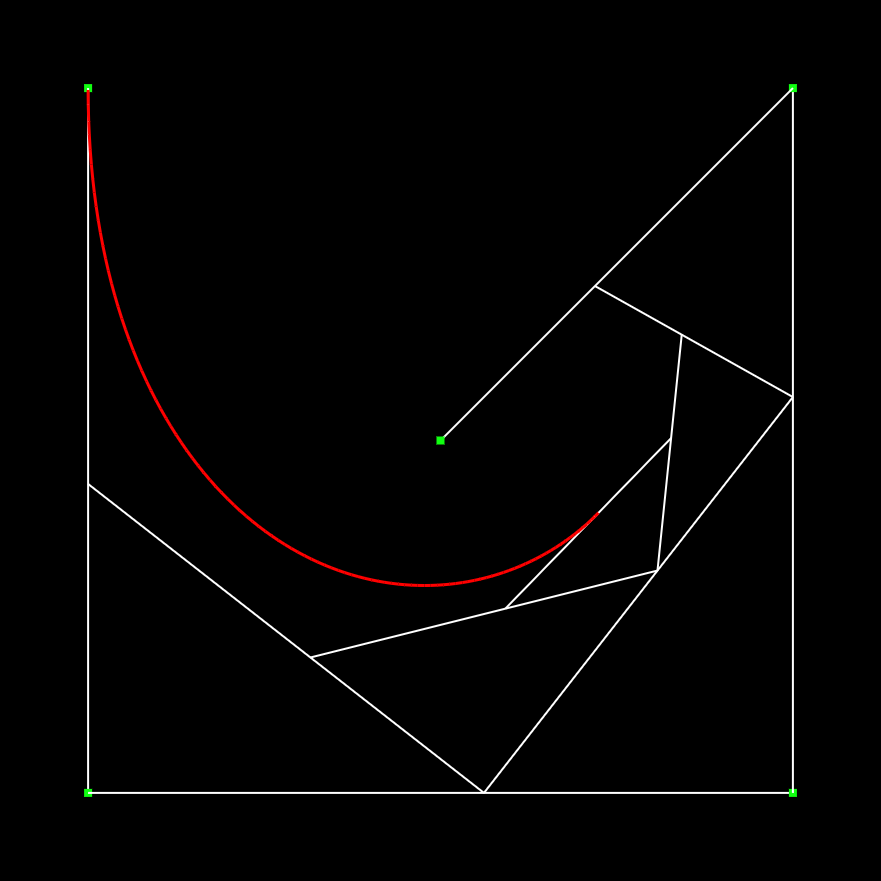

# Bézier Curves Interactive Demo

[]

An interactive web-based demonstration of Bézier curves. Click to add control points, drag to adjust them, and watch the curve update in real time. Perfect for learning how Bézier curves work!

## 🚀 Live Demo

Try it now: [https://mahmoud-eltahawy.github.io/bezier-curves](https://mahmoud-eltahawy.github.io/bezier-curves)

## ✨ Features

- **Add control points** – click on the canvas to place points.
- **Drag points** – move any control point to see the curve change dynamically.
- **Remove the last point** – undo the last addition with one click.
- **Reset the canvas** – clear all points and start fresh.
- **Replay animation** – watch the curve being drawn step by step (optional, if implemented).
- **Real‑time visualization** – the Bézier curve and control polygon are drawn instantly.

## 🧠 What Are Bézier Curves?

Bézier curves are parametric curves widely used in computer graphics, animation, and font design. A curve is defined by a set of control points:
- The curve starts at the first point and ends at the last.
- Intermediate points act as “magnets” that pull the curve into shape.

This demo helps you build an intuition by letting you interact directly with the points.

## 🕹️ How to Use

1. Open the [live demo](https://mahmoud-eltahawy.github.io/bezier-curves).
2. **Add points** by clicking anywhere on the canvas.
3. **Drag** any control point (the small circles) to reshape the curve.
4. Use the buttons:
   - **Add point** – same as clicking on the canvas.
   - **Pop last point** – remove the most recently added point.
   - **Reset** – clear all points.
   - **Replay** – animate the curve drawing (if implemented).
5. Experiment with different point configurations to see how the curve behaves!

## 🛠️ Implementation

The demo is built with vanilla HTML, CSS, and JavaScript. The Bézier curve is computed using the De Casteljau's algorithm or direct Bernstein polynomial evaluation (depending on your implementation). All drawing is done on an HTML5 canvas.

**Key files:**
- `index.html` – page structure and canvas.
- `index.js` – all interaction logic and curve rendering.
